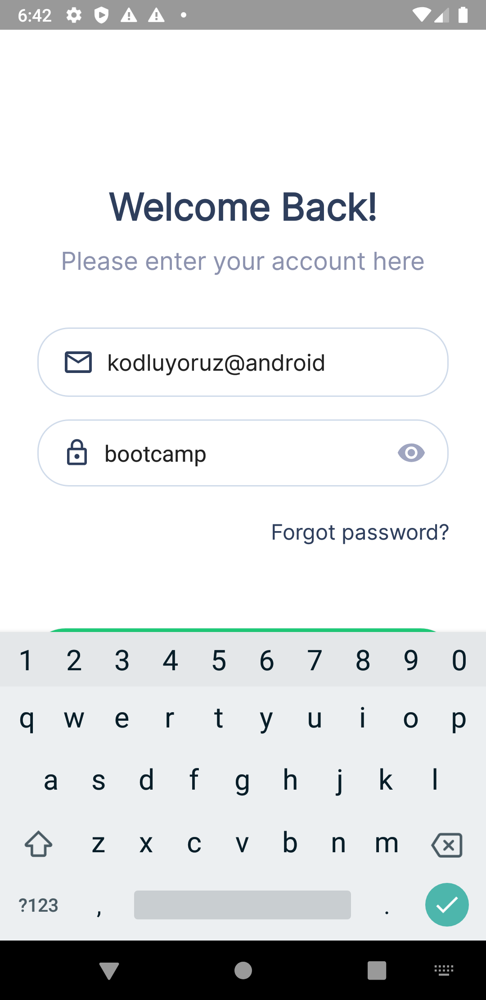

# android-views-nerminkemanci

## PAGES, CLASSES & FRAMEWORKS

#### ACTIVITIES
    • LoginActivity.class
    • MainActivity.class
    
  

#### FRAMEWORKS
    • Material Components
   
  

## USER MANUEL
###  Main Activity

###  Login Activity
&nbsp;&nbsp;&nbsp;&nbsp;

