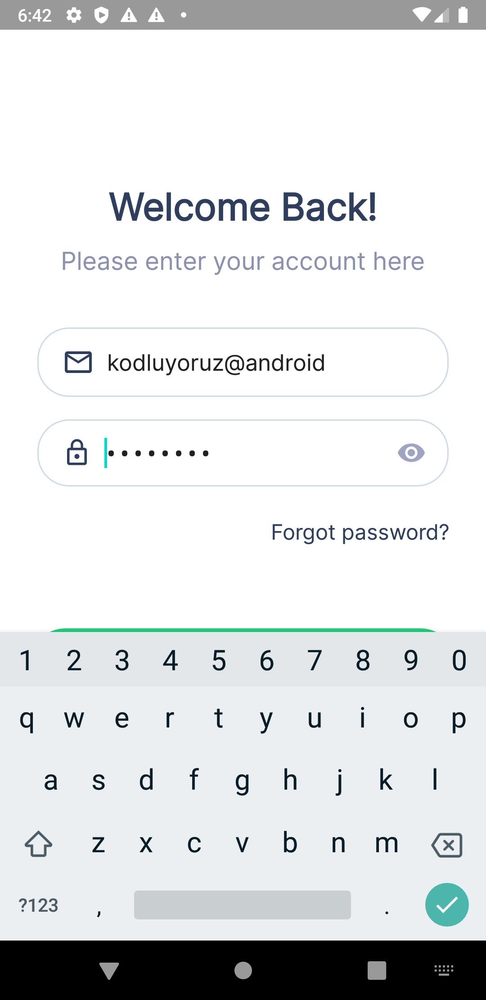

# android-views-nerminkemanci

## PAGES, CLASSES && FRAMEWORKS

#### VIEWs or  ACTIVITIES
    • LoginActivity.class
    • MainActivity.class
    
  

#### FRAMEWORKS
    • Material Components
   
  

## USER MANUEL
####  Main Activity

####  Login Activity
<pre>

